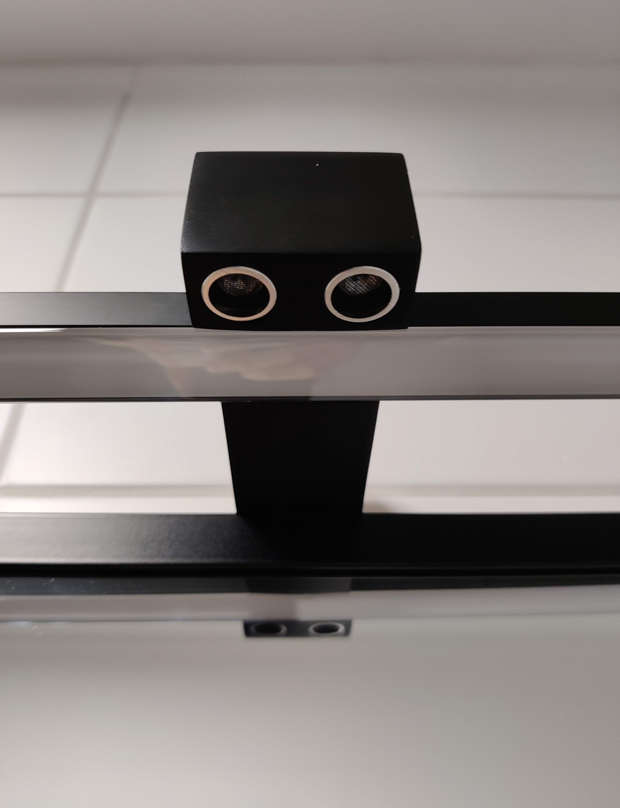
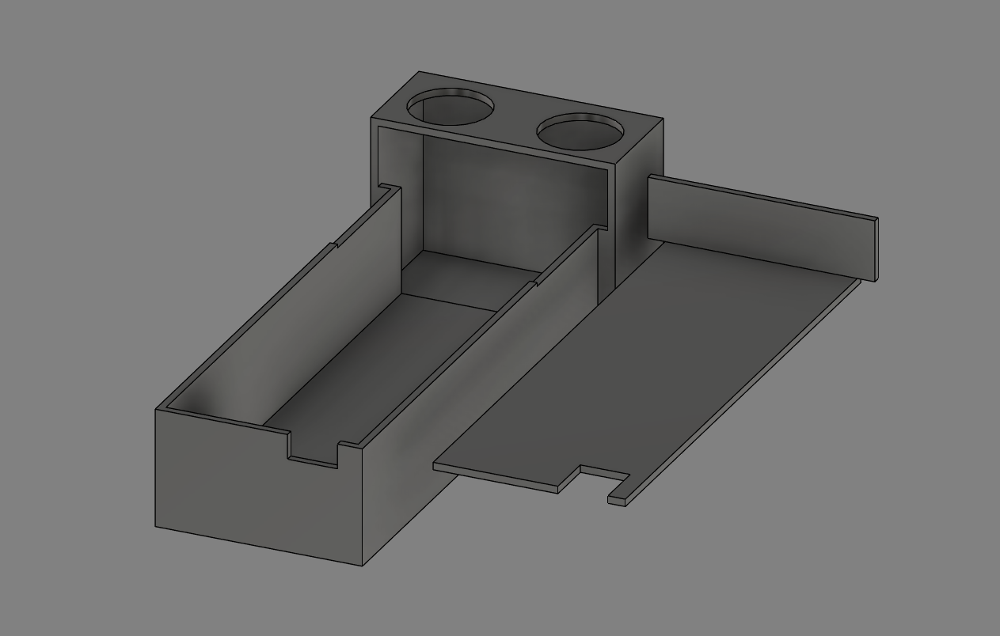

# ESP01 Proximity Relay

Proximity sensor aided relay with HTTP API to my bathroom mirror lights.

Want a discrete light switch which can be operated by reaching out to your light source?
Forgot to switch off the bathroom mirror light, but too lazy to get up from the bed?
Here you go.



See more [here](img/).

WIP:
- wiring diagram

## What you need

- Arduino Studio
- ESP8266-01
- JoyIt ESP-01S relay module (or clone)
- CH340 TTL-UART programmer (ideally with the flash button)
- soldering station
- some wires rated for your load
- (optional) Wago connectors
- (optional) 3D printer

## Build

TODO

## Enclosure

If you happen to have [the same bathroom mirror lights](https://www.obi.at/zubehoer-fuer-spiegel/maximus-led-spiegelleuchte-esther-50-cm-schwarz/p/8040370) as me, knock yourself out.



## Flash

You might run into connectivity problems with the most recent CH340 driver. Version ```08/08/2014, 3.4.2014.08``` worked for me as teh internetz suggested.
